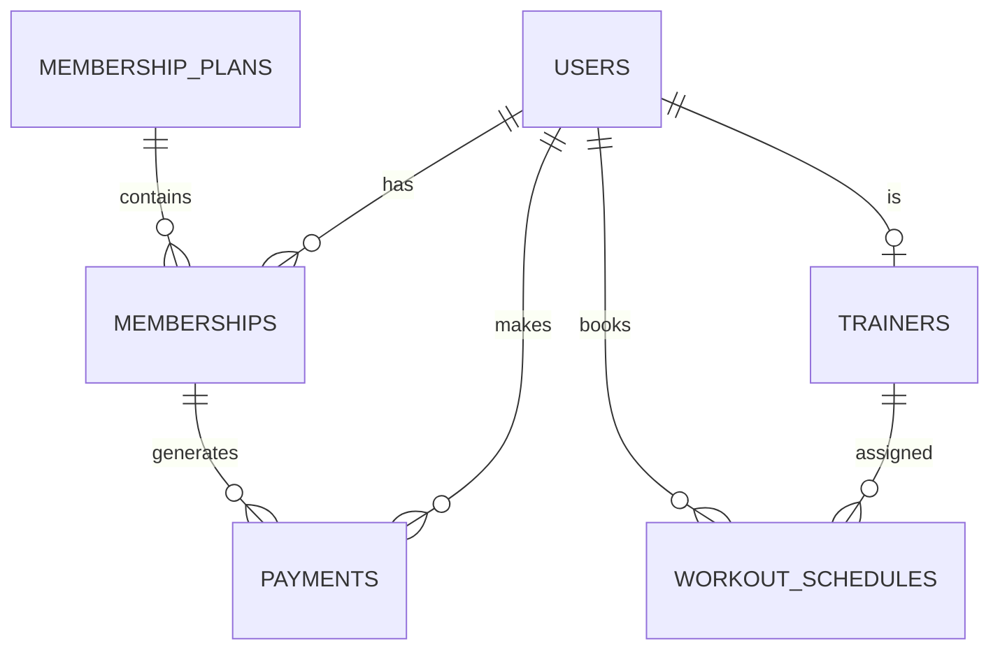


# 02. Thiết kế cơ sở dữ liệu

## 1. Tổng quan

Database của FitLife hiện dùng SQLite cho Level 1. Lựa chọn này phù hợp với đồ án vì dễ khởi tạo, không cần cài thêm database server riêng và đủ để mô phỏng nghiệp vụ quản lý phòng gym.

Thiết kế dưới đây phản ánh schema đang được triển khai trong backend và dùng cho các API hiện có.

Các bảng được mô tả theo hướng đơn giản, dễ đọc và đủ dùng cho nghiệp vụ cốt lõi của đề tài 05.

## 2. Danh sách bảng hiện có

- `users`
- `membership_plans`
- `memberships`
- `trainers`
- `workout_schedules`
- `payments`

## 3. Bảng `users`

Lưu thông tin tài khoản người dùng.

| Cột | Kiểu dữ liệu | Mô tả |
|---|---|---|
| id | INTEGER PRIMARY KEY AUTOINCREMENT | Mã user |
| full_name | TEXT NOT NULL | Họ tên |
| email | TEXT UNIQUE NOT NULL | Email đăng nhập |
| password_hash | TEXT NOT NULL | Mật khẩu đã mã hóa |
| role | TEXT NOT NULL | admin/member/trainer |
| phone | TEXT | Số điện thoại |
| created_at | DATETIME | Ngày tạo |
| updated_at | DATETIME | Ngày cập nhật |

## 4. Bảng `membership_plans`

Lưu danh sách gói tập hiện có cung cấp cho hội viên.

| Cột | Kiểu dữ liệu | Mô tả |
|---|---|---|
| id | INTEGER PRIMARY KEY AUTOINCREMENT | Mã gói |
| name | TEXT NOT NULL | Tên gói |
| price | REAL NOT NULL | Giá tiền |
| duration_days | INTEGER NOT NULL | Số ngày sử dụng |
| description | TEXT | Mô tả |
| status | TEXT DEFAULT 'active' | active/inactive |
| created_at | DATETIME | Ngày tạo |
| updated_at | DATETIME | Ngày cập nhật |

## 5. Bảng `memberships`

Lưu thông tin đăng ký gói tập của hội viên.

| Cột | Kiểu dữ liệu | Mô tả |
|---|---|---|
| id | INTEGER PRIMARY KEY AUTOINCREMENT | Mã đăng ký |
| user_id | INTEGER NOT NULL | Hội viên |
| plan_id | INTEGER NOT NULL | Gói tập |
| start_date | DATE NOT NULL | Ngày bắt đầu |
| end_date | DATE NOT NULL | Ngày kết thúc |
| status | TEXT DEFAULT 'active' | active/expired/cancelled |
| created_at | DATETIME | Ngày tạo |
| updated_at | DATETIME | Ngày cập nhật |

## 6. Bảng `trainers`

Lưu thông tin huấn luyện viên và thông tin chuyên môn hiện có.

| Cột | Kiểu dữ liệu | Mô tả |
|---|---|---|
| id | INTEGER PRIMARY KEY AUTOINCREMENT | Mã trainer |
| user_id | INTEGER NOT NULL | Liên kết với `users` |
| specialization | TEXT | Chuyên môn |
| experience_years | INTEGER | Số năm kinh nghiệm |
| bio | TEXT | Giới thiệu |
| status | TEXT DEFAULT 'active' | active/inactive |
| created_at | DATETIME | Ngày tạo |
| updated_at | DATETIME | Ngày cập nhật |

## 7. Bảng `workout_schedules`

Lưu lịch tập giữa member và trainer.

| Cột | Kiểu dữ liệu | Mô tả |
|---|---|---|
| id | INTEGER PRIMARY KEY AUTOINCREMENT | Mã lịch |
| member_id | INTEGER NOT NULL | Hội viên |
| trainer_id | INTEGER NOT NULL | Huấn luyện viên |
| schedule_date | DATE NOT NULL | Ngày tập |
| start_time | TEXT NOT NULL | Giờ bắt đầu |
| end_time | TEXT NOT NULL | Giờ kết thúc |
| status | TEXT DEFAULT 'pending' | pending/confirmed/completed/cancelled |
| note | TEXT | Ghi chú |
| created_at | DATETIME | Ngày tạo |
| updated_at | DATETIME | Ngày cập nhật |

## 8. Bảng `payments`

Lưu thông tin thanh toán mô phỏng khi member đăng ký gói tập.

| Cột | Kiểu dữ liệu | Mô tả |
|---|---|---|
| id | INTEGER PRIMARY KEY AUTOINCREMENT | Mã thanh toán |
| user_id | INTEGER NOT NULL | Người thanh toán |
| membership_id | INTEGER NOT NULL | Gói đăng ký |
| amount | REAL NOT NULL | Số tiền |
| payment_method | TEXT | cash/bank/momo |
| payment_status | TEXT | paid/pending/failed |
| created_at | DATETIME | Ngày tạo |
| updated_at | DATETIME | Ngày cập nhật |

## 9. Quan hệ giữa các bảng

| Quan hệ | Mô tả |
|---|---|
| `users` 1-n `memberships` | Một user có thể đăng ký nhiều gói tập theo thời gian |
| `membership_plans` 1-n `memberships` | Một gói có thể được nhiều user đăng ký |
| `users` 1-1 `trainers` | Một trainer là một user có role `trainer` |
| `users` 1-n `workout_schedules` | Một member có thể có nhiều lịch tập |
| `trainers` 1-n `workout_schedules` | Một trainer có thể có nhiều lịch dạy |
| `memberships` 1-1 `payments` | Một lần đăng ký tạo một payment mô phỏng |

## 10. Ghi chú thiết kế

- Schema hiện đang dùng SQLite và được khởi tạo qua file schema.sql.
- Các bảng có liên kết logic qua user_id, plan_id, membership_id, trainer_id.
- Schema ưu tiên tính đơn giản để phục vụ demo, kiểm thử và mô phỏng nghiệp vụ của đồ án.

## 11. ERD dạng Mermaid

