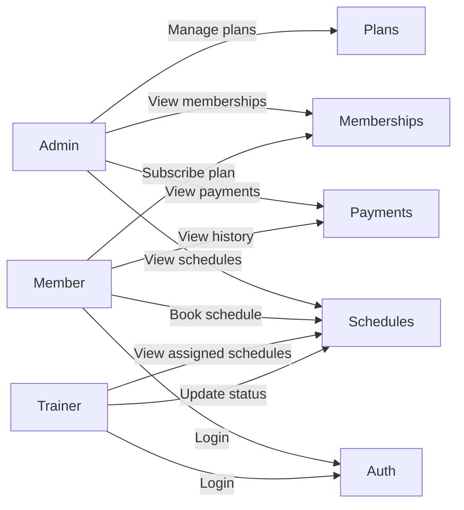


# 04. Modules and Use Cases

## 1. Tổng quan module

Hệ thống FitLife được chia thành các module nghiệp vụ để dễ triển khai, kiểm thử và phân công công việc. Cách chia này giúp bám sát ba vai trò chính của hệ thống là Admin, Member và Trainer.

Các module chính hiện có gồm:

- Auth Module
- Membership Plan Module
- Membership Module
- Trainer Module
- Schedule Module
- Payment Module

## 2. Auth Module

### Mục tiêu

Quản lý đăng ký, đăng nhập, lấy thông tin người dùng hiện tại và kiểm tra phân quyền.

### Use cases chính

| Use case | Diễn giải |
|---|---|
| Member đăng ký tài khoản | Người dùng mới tạo tài khoản hội viên |
| User đăng nhập | Người dùng gửi email và mật khẩu để lấy token |
| Lấy thông tin hiện tại | Backend trả về hồ sơ user từ JWT |
| Kiểm tra quyền truy cập | Backend xác định role trước khi cho phép thao tác |

## 3. Membership Plan Module

### Mục tiêu

Quản lý các gói tập mà phòng gym cung cấp cho hội viên.

### Use cases chính

| Use case | Diễn giải |
|---|---|
| Xem danh sách gói | Member, Trainer và Admin có thể xem các gói đang hoạt động |
| Xem chi tiết gói | Người dùng xem thông tin đầy đủ của một gói tập |
| Thêm gói tập | Admin tạo gói tập mới |
| Cập nhật gói tập | Admin chỉnh sửa tên, giá, thời hạn, mô tả |
| Xóa gói tập | Admin xóa mềm hoặc vô hiệu hóa gói |

## 4. Membership Module

### Mục tiêu

Quản lý việc hội viên đăng ký gói tập và theo dõi trạng thái membership.

### Use cases chính

| Use case | Diễn giải |
|---|---|
| Đăng ký gói tập | Member chọn một plan để đăng ký |
| Xem membership của tôi | Member xem danh sách gói đã đăng ký của mình |
| Xem toàn bộ membership | Admin xem tất cả đăng ký trong hệ thống |
| Tự tạo thời gian hiệu lực | Backend tự tính `start_date` và `end_date` theo plan |

## 5. Trainer Module

### Mục tiêu

Quản lý thông tin huấn luyện viên và liên kết trainer với tài khoản user có role phù hợp.

### Use cases chính

| Use case | Diễn giải |
|---|---|
| Xem danh sách trainer | Member và Admin xem trainer đang hoạt động |
| Thêm trainer | Admin tạo hồ sơ trainer mới |
| Cập nhật trainer | Admin sửa chuyên môn, bio, kinh nghiệm |
| Xóa trainer | Admin xóa hoặc chuyển trainer sang trạng thái ngừng hoạt động |
| Liên kết tài khoản trainer | Mỗi trainer gắn với một user có role `trainer` |

## 6. Schedule Module

### Mục tiêu

Quản lý lịch tập giữa member và trainer, gồm đặt lịch, xác nhận và theo dõi trạng thái.

### Use cases chính

| Use case | Diễn giải |
|---|---|
| Đặt lịch tập | Member chọn trainer, ngày và giờ tập |
| Xem lịch của tôi | Member xem các lịch đã đặt |
| Xem lịch trainer | Trainer xem lịch dạy của mình |
| Xem toàn bộ lịch | Admin xem tất cả lịch trong hệ thống |
| Cập nhật trạng thái lịch | Trainer hoặc Admin đổi trạng thái lịch sang confirmed/completed/cancelled |

## 7. Payment Module

### Mục tiêu

Mô phỏng thanh toán khi member đăng ký gói tập.

### Use cases chính

| Use case | Diễn giải |
|---|---|
| Tạo payment mô phỏng | Backend tạo payment khi member đăng ký gói |
| Xem payment của tôi | Member xem lịch sử thanh toán cá nhân |
| Xem toàn bộ payment | Admin xem mọi payment trong hệ thống |
| Ghi nhận trạng thái payment | Thanh toán dùng các trạng thái paid/pending/failed |

## 8. Luồng nghiệp vụ chính

### Luồng đăng ký gói tập

Member đăng nhập -> Xem gói tập -> Chọn gói tập -> Gửi yêu cầu đăng ký -> Backend kiểm tra plan -> Backend tạo membership -> Backend tạo payment mô phỏng -> Trả kết quả thành công

### Luồng đặt lịch trainer

Member đăng nhập -> Xem trainer -> Chọn ngày và giờ -> Gửi yêu cầu đặt lịch -> Backend kiểm tra membership active -> Backend kiểm tra trùng lịch trainer -> Backend tạo lịch `pending` -> Trainer xác nhận -> Lịch chuyển sang `confirmed`

## 9. Use case diagram

## 10. Ghi chú triển khai

- Các module trên là thiết kế hiện có cho Level 1.
- Mỗi module được triển khai qua controller và middleware phù hợp.
- Các use case liên quan đến quyền truy cập sẽ đi kèm middleware kiểm tra JWT và role.

